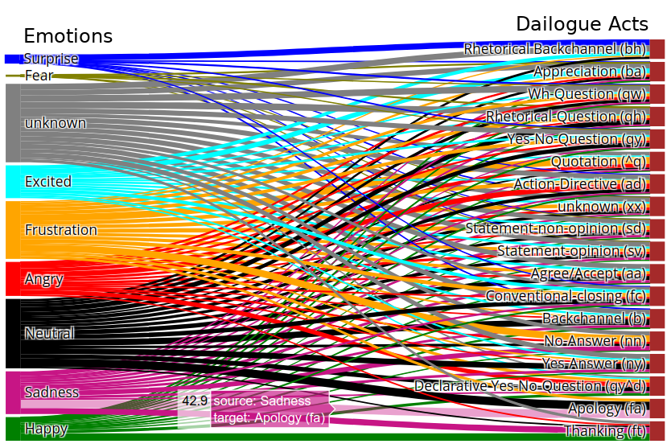
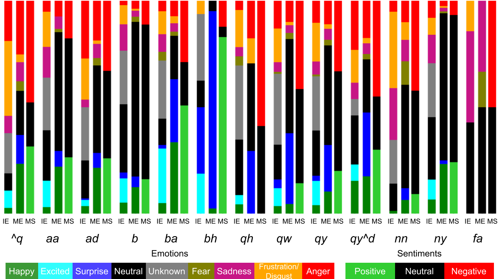

# EDAs: Emotional Dialogue Acts Corpus

----------------------------------------------------

## Introduction

Emotional Dialogue Act data contains dialogue act labels 
for existing emotion multi-modal conversational datasets.

Dialogue act provides an intention and performative function in an utterance of the dialogue.
For example, it can infer a user's intention by distinguishing _Question_, _Answer_, _Request_, _Agree/Reject_, etc.
and performative functions such as _Acknowledgement_, _Conversational-opening or -closing_, _Thanking_, etc.


The aim is to enrich the existing multimodal conversational 
emotion dataset that would help advancing conversational analysis 
and help to build natural dialogue systems.

We chose two popular multimodal emotion datasets: 
Multimodal EmotionLines Dataset (MELD) and 
Interactive Emotional dyadic MOtion CAPture database (IEMOCAP).

MELD contains two labels for each utterance in a dialogue: 
Emotions and Sentiments.

- Emotions -- Anger, Disgust, Sadness, Joy, Neutral, Surprise and Fear.

- Sentiments -- positive, negative and neutral.

IEMOCAP contains only emotion but at two levels: 
Discrete and Fine-grained Dimensional Emotions 

- Discrete Emotions: Anger, Frustration, Sadness, Joy, Excited,
Neutral, Surprise and Fear.

- Fine-grained Dimensional Emotions: Valence, Arousal and Dominance.


## Analysis on EDAs

Our analysis on EDAs reveal association between 
dialogue acts and emotional states in natural-conversational language. 
Visualizing co-occurrence of utterances with emotion states 
in the particular dialogue acts, please see the graph below from IEMOCAP EDAs:



See live plots/graphs (thanks to Plot.ly):
[IEMOCAP Emotion Sankey](https://chart-studio.plot.ly/~bothe/3), 
[MELD Emotion Sankey](https://chart-studio.plot.ly/~bothe/7), and 
[MELD Sentiment Sankey](https://chart-studio.plot.ly/~bothe/11).


or bar diagram (as in the paper):



IE: IEMOCAP, ME: MELD Emotion and MS: MELD Sentiment.

See separated bar graphs in figures: [IEMOCAP Emotion Bars](figures/iemocap_bars_emotion.png), 
[MELD Emotion Bars](figures/meld_bars_emotion.png), and [MELD Sentiment Bars](figures/meld_bars_sentiment.png).


<details><summary><b>Click for the Names and statistics of annotated Dialogue Acts in EDAs</b></summary>
<p>
<table>
<tr>
<th>DA                    </th> <th> Dialogue Act                </th> <th> IEMO   </th> <th> MELD   </th>
</tr><tr>
<td>sd                    </td> <td> Statement-non-opinion       </td> <td> 43.97  </td> <td> 41.63  </td>
</tr><tr>
<td>sv                    </td> <td> Statement-opinion           </td> <td> 19.93  </td> <td> 09.34  </td>
</tr><tr>
<td>qy                    </td> <td> Yes-No-Question             </td> <td> 10.3   </td> <td> 12.39  </td>
</tr><tr>
<td>qw                    </td> <td> Wh-Question                 </td> <td>  7.26  </td> <td> 6.08   </td>
</tr><tr>
<td>b                     </td> <td> Acknowledge (Backchannel)   </td> <td>  2.89  </td> <td> 2.35   </td>
</tr><tr>
<td>ad                    </td> <td> Action-directive            </td> <td>  1.39  </td> <td> 2.31   </td>
</tr><tr>
<td>fc                    </td> <td> Conventional-closing        </td> <td>  1.37  </td> <td> 3.76   </td>
</tr><tr>
<td>ba                    </td> <td> Appreciation or Assessment  </td> <td>  1.21  </td> <td> 3.72   </td>
</tr><tr>
<td>aa                    </td> <td> Agree or Accept             </td> <td>  0.97  </td> <td> 0.50   </td>
</tr><tr>
<td>nn                    </td> <td> No-Answer                   </td> <td>  0.78  </td> <td> 0.80   </td>
</tr><tr>
<td>ny                    </td> <td> Yes-Answer                  </td> <td>  0.75  </td> <td> 0.88   </td>
</tr><tr>
<td>br                    </td> <td> Signal-non-understanding    </td> <td>  0.47  </td> <td> 1.13   </td>
</tr><tr>
<td>^q                    </td> <td> Quotation                   </td> <td>  0.37  </td> <td> 0.81   </td>
</tr><tr>
<td>na                    </td> <td> Affirmative non-yes answers </td> <td>  0.25  </td> <td> 0.34   </td>
</tr><tr>
<td>qh                    </td> <td> Rhetorical-Question         </td> <td>  0.23  </td> <td> 0.12   </td>
</tr><tr>
<td>bh                    </td> <td> Rhetorical Backchannel      </td> <td>  0.16  </td> <td> 0.30   </td>
</tr><tr>
<td>h                     </td> <td> Hedge                       </td> <td>  0.15  </td> <td> 0.02   </td>
</tr><tr>
<td>qo                    </td> <td> Open-question               </td> <td>  0.14  </td> <td> 0.10   </td>
</tr><tr>
<td>ft                    </td> <td> Thanking                    </td> <td>  0.13  </td> <td> 0.23   </td>
</tr><tr>
<td>qy^d                  </td> <td> Declarative Yes-No-Question </td> <td>  0.13  </td> <td> 0.29   </td>
</tr><tr>
<td>bf                    </td> <td> Reformulate                 </td> <td>  0.12  </td> <td> 0.19   </td>
</tr><tr>
<td>fp                    </td> <td> Conventional-opening        </td> <td>  0.12  </td> <td> 1.19   </td>
</tr><tr>
<td>fa                    </td> <td> Apology                     </td> <td>  0.07  </td> <td> 0.04   </td>
</tr><tr>
<td>fo                    </td> <td> Other Forward Function      </td> <td>  0.02  </td> <td> 0.05   </td>
</tr><tr>
<td>Total                 </td> <td>                             </td> <td> 10039  </td> <td> 13708 </td>
</tr>
</table>
Number of utterances per DA in respective datasets. 
All values are in percentages (\%) of the total number of utterances. 
IEMO is for IEMOCAP.
</p>
</details>


**These graphs can be generated using ```read_annotated_..._data.py``` applications**

## Paper: Automated Neural Ensemble Annotation and Evaluation

_"Enriching Existing Conversational Emotion Datasets with Dialogue Acts using Neural Annotators"_

The pre-print of the article (accepted at LREC 2020) explaining these datasets can be found at - 
https://arxiv.org/abs/1912.00819

## Acknowledgement  
This work has been performed as part of the SECURE EU Project 

https://secure-robots.eu/fellows/bothe/EDAs/

## Description of the .csv files

### The files
- ```annotated_eda_data/eda_iemocap_no_utts_dataset.csv``` - contains the EDAs in IEMOCAP data, without utterances.
- ```annotated_eda_data/eda_meld_emotion_dataset.csv``` - contains the EDAs in meld data, they are staked (train, dev, test).

### What else there in the files... 
<details><summary><b>Click for understanding the csv files</b></summary>
<p>

| Column Name  | Description                                                                                                        |
|--------------|--------------------------------------------------------------------------------------------------------------------|
| speaker      | Name of the speaker (in MELD) or speaker id (in IEMOCAP)                                                           |
| utt_id       | The index of an utterance in the dialogue, starting from 0 (in Meld) or starting 0 from speaker turn (in IEMOCAP)  |
| utterance    | String of utterance.                                                                                               |
| emotion      | The emotion (neutral, joy, excited, sadness, anger, surprise, fear, frustration, disgust) expressed by the speaker in the utterance.  |
| sentiment    | The sentiment (positive, neutral, negative) expressed by the speaker in the utterance (only in MELD).              |
| eda1         | Emotional dialogue act label from Utterance-level 1 model.                                                         |
| eda2         | Emotional dialogue act label from Utterance-level 2 model.                                                         |
| eda3         | Emotional dialogue act label from Context 1 model.                                                                 |
| eda4         | Emotional dialogue act label from Context 2 model.                                                                 |
| eda5         | Emotional dialogue act label from Context 3 model.                                                                 |
| EDA          | Final emotional dialogue act as an ensemble of all models (eda1, eda2, eda3, eda4, eda5)                           |
| all_match    | Flag to indicate if all EDAs are matching (eda1 = eda2 = eda3 = eda4 = eda5).                                      |
| con_match    | Flag to indicate EDAs matched based on context models.                                                             |
| match        | Flag to indicate EDAs matched based on confidence ranking.                                                         |

</p>
</details>


## Running the scripts

In case, if you want to reproduce the python environment used for the entire project, 
please find the  ```conda_env/environment.yml``` file
which can be maneged via conda (anaconda or miniconda).

1. Run ```dia_act_meld_ensemble.py``` or ```dia_act_mocap_ensemble.py``` for respective data,
 to generate and calculate the reliability metrics ensemble of the dialogue acts given that all the labels are stored in ```model_output_labels``` directory.

2. Run ```read_annotated_mocap_data.py``` or ```read_annotated_meld_data.py``` to read, generate the the graph and and calculate the data statistics   

Currently, all the predictions are available in the ```model_output_labels``` directory, hence we skip the following.

3. Run ```dia_act_meld_annotator.py``` or ```dia_act_mocap_annotator.py``` to annotate the datasets; 
given that models exists they will be updated soon.


## Annotate your own conversational data: Server API

In case, you want to annotate the conversational data, 
please find the  ```dialogue_act_annotator.py``` file,
which contains a client example for sending the requests to the server API
that takes care to generate utterance representation and make the predictions.

You just need to arrange ```utterances``` into list along with other 
lists such as ```speaker```, ```utt_id``` and ```emotion``` 
(it is optional, if you have any other annotation per utterance, 
or just pass flag ```is_emotion=False``` in ```ensemble_eda_annotation()``` function.). 

*This API is not fully tested, hence send the requests at your own risk!*

*However, it is fully automated and hosted via 
Uni-Hamburg, Informatik web servers.*

*Try to send, not more than 500 utterances, if it is above that number, 
server might take long to respond, hence it is recommended 
to contact author [bothe] for your query.*


## Referring to the work

Paper explaining the process of dialogue act annotation:

C. Bothe, C. Weber, S. Magg, S. Wermter. 
_Enriching Existing Conversational Emotion Datasets with Dialogue Acts using Neural Annotators.
(LREC 2020)
https://secure-robots.eu/fellows/bothe/EDAs/

The original work of datasets:

-IEMOCAP:

Busso, C., Bulut, M., Lee, C.-C., Kazemzadeh, A., Mower, E., Kim, S., Chang, J. N., Lee, S., and Narayanan, S. S. 
_IEMOCAP: Interactive emotional dyadic motion capture database._
(Language Resources and Evaluation 2008)
https://sail.usc.edu/iemocap/

-MELD:

S. Poria, D. Hazarika, N. Majumder, G. Naik, E. Cambria, R. Mihalcea. 
_MELD: A Multimodal Multi-Party Dataset for Emotion Recognition in Conversation._ 
(ACL 2019)
https://affective-meld.github.io/

Chen, S.Y., Hsu, C.C., Kuo, C.C. and Ku, L.W. 
_EmotionLines: An Emotion Corpus of Multi-Party Conversations._
(arXiv preprint arXiv:1802.08379 2018)


